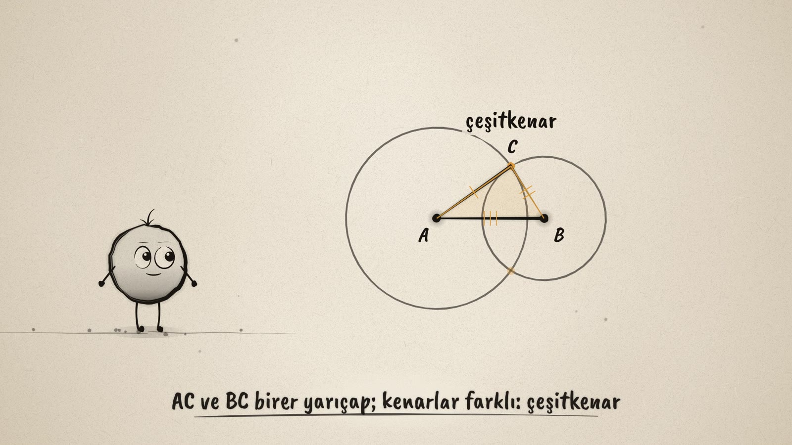
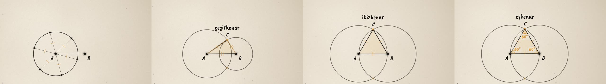

# Çemberlerle Üçgen · Triangles from Circles

**▶ Tarayıcıda izleyin / Watch in the browser:** https://hakanatas.github.io/cemberlerle-ucgen/ 
**⬇ MP4 + altyazılar / MP4 + subtitles:** [Releases](https://github.com/hakanatas/cemberlerle-ucgen/releases) 
**✎ Kullanılan istem / The prompt behind it:** [PROMPT.md](PROMPT.md) 
**🎞 Bütün filmler / All films:** [Nokta'nın Filmleri](https://hakanatas.github.io/nokta-filmleri/)

> **TR —** 5. sınıf matematik "Geometrik Şekiller" temasındaki MAT.5.3.7 öğrenme çıktısı için hazırlanmış, tamamen JavaScript ile çizilen 92 saniyelik mürekkep animasyonu. Nokta, A ve B merkezli iki çember çiziyor. Merkezler ve bir kesişim noktası bir üçgen oluşturuyor. AC ve BC birer yarıçap olduğu için kenarların özellikleri ölçmeden anlaşılıyor. Yarıçaplar farklıysa üçgen çeşitkenar, eşitse ikizkenar, AB kadarsa eşkenar oluyor. Altyazılar Türkçe, İngilizce ya da ikisi birlikte seçilebilir.

A 92-second ink animation for **5th-grade maths**, drawn entirely with JavaScript on an HTML5 canvas. It is the sixth film in the geometry series and covers the last outcome of the theme. Nokta, the ink character from [The Learning Ink](https://github.com/hakanatas/the-learning-ink), is the guide again.

## Learning outcome

MEB, Türkiye Yüzyılı Maarif Modeli, Ortaokul Matematik, 5th grade, "Geometrik Şekiller" theme:

**MAT.5.3.7. Matematiksel araç ve teknoloji yardımıyla düzlemde iki noktada kesişen çember çiftinin merkezleri ve kesişim noktalarından biri ile inşa edilen üçgenlerin kenar özelliklerine yönelik çıkarım yapabilme**
- a) … inşa edilebilecek üçgenlerin kenar özelliklerine yönelik varsayımlarda bulunur.
- b) Örnek çizimler üzerinden … çeşitkenar, ikizkenar ve eşkenar üçgenleri belirler.
- c) Belirlediği üçgenlerin özelliklerini varsayımları ile karşılaştırır.
- d) Varsayımlarını … doğrulayabileceği önermeler şeklinde ifade eder.

The program expects students to notice that they can build scalene, isosceles and equilateral triangles *"herhangi bir ölçme aracı kullanmaksızın yalnızca çemberin özelliklerini kullanarak"* (without any measuring tool, using only the properties of the circle). That is the central idea of the film.

## How the animation works

A and B are fixed. The film only stores the two radii over time: `r1(t)` for the circle around A and `r2(t)` for the circle around B. C is computed as the circles' upper crossing point, so AC = r1 and BC = r2 by construction. When the radii change live, the triangle changes with them, and the equal-length marks stay true.

## Scenes

| # | Time | Scene | What happens | Outcome |
|---|---|---|---|---|
| 1 | 0–10 s | İki nokta | Nokta marks A and B. "Can we build a triangle without measuring?" | Intro |
| 2 | 10–24 s | Çember ve yarıçap | The compass draws a circle. Six radii get the same tick mark: every point is one radius away. | Circle property |
| 3 | 24–42 s | İki çember, bir üçgen | Circles around A and B cross at two points. A, B and C make a triangle. AC and BC light up as radii. Different radii give a **scalene** triangle. | 5.3.7 b |
| 4 | 42–58 s | Eşit yarıçap | Both radii become equal. First a guess ("what kind of triangle?"), then AC = BC gives an **isosceles** triangle. The radius grows and shrinks, and the triangle stays isosceles. | 5.3.7 a, b, c |
| 5 | 58–72 s | Yarıçap = AB | The compass opens to AB, so each circle passes through the other centre. All three sides are radii: **equilateral**, 60° at every corner. | 5.3.7 b, d |
| 6 | 72–84 s | Üçü bir arada | The three constructions side by side. "Hiç ölçmeden, sadece çemberle!" | 5.3.7 d |
| 7 | 84–92 s | Aklında kalsın | "İki çember + bir kesişim noktası = üçgen." Nokta celebrates. | Wrap-up |

## Running it

- **Preview:** double-click `index.html` (it works offline).
- **MP4:** run `npm install` once, then `npm run export -- --format=horizontal --captions=tr`.
- **Subtitles and narration:** `npm run srt` writes `out/captions_*.srt` and `narration_notes.txt`.
- **Editing:**
  - Caption text, timings and narration notes: `captions.js`
  - Scenes: `scenes/scene1.js` … `scene7.js`
  - Radii over time (`r1`, `r2`), the crossing point (`cross`), compass circles, tick marks and Nokta's poses: `src/draw/film.js`

It uses the same engine as The Learning Ink: `renderFrame(t)` as a pure function of time, seeded randomness, and frame-by-frame export.

## Lisans · License

**TR —** Bu film ve kodu [Creative Commons Atıf-GayriTicari 4.0 Uluslararası (CC BY-NC 4.0)](https://creativecommons.org/licenses/by-nc/4.0/deed.tr) lisansıyla paylaşılır. Ticari olmayan her amaçla (derste, okulda, eğitim materyalinde) kopyalayabilir, paylaşabilir ve değiştirebilirsiniz; ancak **kaynak göstermek zorunludur**: eser sahibinin adı ve bu deponun bağlantısı belirtilmeden kullanılamaz. Ticari kullanım (satış, ücretli ürün ya da yayın) için izin alınmalıdır.

**EN —** This film and its code are licensed under [Creative Commons Attribution-NonCommercial 4.0 International (CC BY-NC 4.0)](https://creativecommons.org/licenses/by-nc/4.0/). You may copy, share and adapt them for non-commercial purposes, but **attribution is required**: they may not be used without crediting the author and linking to this repository. Commercial use requires permission.

Atıf örneği / Required credit: *“Çemberlerle Üçgen”, Hakan Ataş, Nokta'nın Filmleri — https://github.com/hakanatas/cemberlerle-ucgen — CC BY-NC 4.0*
